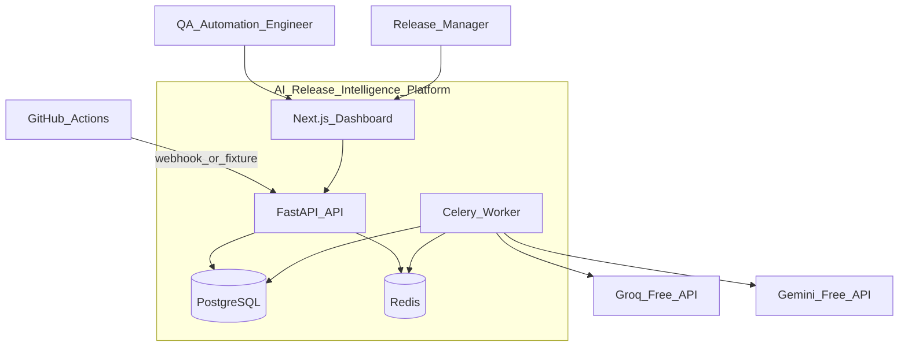

# System Context

## Overview

The AI Release Intelligence Platform sits between CI systems (GitHub Actions) and engineering users who triage failures and assess release risk.

## Context diagram

## External actors

| Actor | Interaction |
|-------|-------------|
| GitHub Actions | Sends workflow_run webhooks (future); fixtures in MVP |
| QA Automation Engineer | Reviews classifications, submits feedback |
| Release Manager | Reads advisory release-risk assessments |
| Groq / Gemini | Free LLM APIs for classification |
| Operator | Seeds demo data, monitors metrics |

## System boundaries

**In scope:** Ingest CI failure context, classify, retrieve similar failures, compute release risk, capture feedback, expose dashboard and API.

**Out of scope (MVP):** Incident management, deployment tracking, multi-org billing, notification delivery, auto release enforcement.

## Trust boundaries

- Webhook payload: untrusted — verify signature, validate schema.
- CI log content: untrusted — mask secrets, prompt injection guards.
- LLM output: untrusted — Pydantic validation, evidence grounding.
- Authenticated users: trusted within org scope only.

## Key quality attributes

- Explainability (deterministic risk, evidence refs)
- Auditability (immutable AI records, feedback, audit log)
- Resilience (provider failover, rule fallback)
- Cost ($0 operating target)
