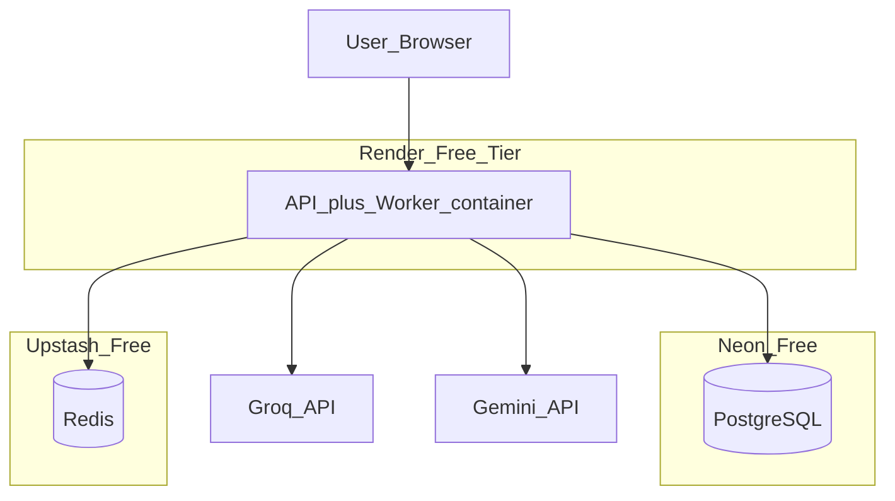

# Container Architecture

## Containers

| Container | Technology | Responsibility |
|-----------|------------|----------------|
| Web | Next.js | Dashboard UI |
| API | FastAPI | REST API, webhook ingestion, auth |
| Worker | Celery | Async processing, AI calls |
| PostgreSQL | Neon (prod) / Docker (local) | Persistent data |
| Redis | Upstash (prod) / Docker (local) | Task queue, broker |

## Deployment topology (MVP free tier)



**Note:** API and worker co-locate in one Render free service to avoid a second billable service. Local dev uses separate containers for clarity.

## Internal module structure (monorepo)

```
apps/api/          # FastAPI routes, deps, startup
apps/worker/       # Celery app, tasks
apps/web/          # Next.js frontend
packages/domain/   # Entities, domain rules, risk engine
packages/shared/   # Config, logging, schemas, AI adapters
migrations/        # Alembic
tests/             # unit, integration, contract, e2e, evals
```

## Layering rules

1. **Routes** — HTTP only; delegate to services.
2. **Services** — orchestration, transactions.
3. **Domain** — business rules, pure functions where possible.
4. **Repositories** — DB access interfaces + SQLAlchemy implementations.
5. **Adapters** — external LLM, future GitHub client.

## Communication

| From | To | Protocol |
|------|-----|----------|
| Web | API | HTTPS REST |
| GitHub | API | HTTPS webhook |
| API | Redis | Celery enqueue |
| Worker | Redis | Task consume |
| Worker | PostgreSQL | SQL |
| Worker | LLM APIs | HTTPS |

## Container decisions

- No separate classification microservice.
- No API gateway in MVP.
- No Kubernetes in MVP.
