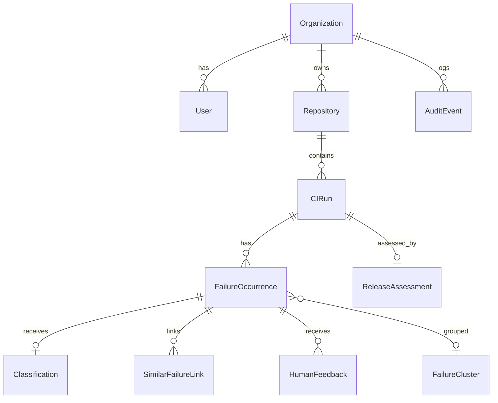

# Domain Model

## Entity relationship (MVP)

## Entities (MVP subset)

### Organization
- Root tenant for MVP (single org in demo).
- Attributes: id, name, slug, created_at.

### User
- Authenticated actor.
- Attributes: id, org_id, email, password_hash, role, created_at.

### Repository
- Connected code repository.
- Attributes: id, org_id, full_name, default_branch, created_at.

### CIRun
- One CI workflow execution.
- Attributes: id, repo_id, workflow_name, branch, commit_sha, conclusion, status_url, processing_status, idempotency_key, ingested_at, completed_at.

### FailureOccurrence
- Single test failure within a run.
- Attributes: id, ci_run_id, test_name, suite_name, error_type, error_message, stack_trace, log_excerpt, retry_number, fingerprint, created_at.

### Classification
- AI or rule-based classification (immutable once written).
- Attributes: id, failure_id, category, subcategory, suspected_component, summary, likely_cause, suggested_action, confidence, evidence_refs, insufficient_information, provider, model, prompt_version, input_hash, input_tokens, output_tokens, duration_ms, trace_id, created_at.

### SimilarFailureLink
- Link to historical match.
- Attributes: id, failure_id, matched_failure_id, method, score.

### FailureCluster
- Optional grouping (MVP: manual link via feedback).
- Attributes: id, org_id, title, created_at.

### ReleaseAssessment
- Deterministic risk result for a CI run.
- Attributes: id, ci_run_id, risk_level, score, factors_json, missing_info_json, recommendation, explanation, created_at.

### HumanFeedback
- User correction or acceptance.
- Attributes: id, failure_id, classification_id, action, corrected_category, corrected_component, note, resolved, cluster_id, created_at.

### AuditEvent
- Security and ops audit trail.
- Attributes: id, org_id, actor_id, action, resource_type, resource_id, correlation_id, metadata_json, created_at.

### IngestedEvent (supporting)
- Raw webhook persistence.
- Attributes: id, delivery_id, event_type, payload_json, correlation_id, created_at.

## Domain rules (examples)

- Classification records are append-only; feedback references classification_id.
- ReleaseAssessment recalculated when all failures in run classified (or on explicit trigger).
- SimilarFailureLink score must be in [0, 1].
- User can only access entities within their organization.

## Status enums

**CIRun.processing_status:** pending, processing, completed, failed, failed_permanent

**ReleaseAssessment.risk_level:** low, medium, high, critical

**HumanFeedback.action:** accept, correct
