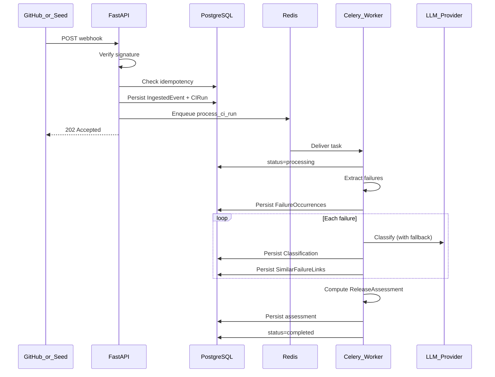

# Event Processing

## Pipeline overview

## Task: process_ci_run

**Input:** ci_run_id, correlation_id  
**Idempotency:** Safe to retry; use processing_status guards.

### Steps

1. Load CI run; skip if already completed.
2. Set status `processing`.
3. Parse failures from ingested payload enrichment.
4. Normalize and persist each failure.
5. For each failure: run classification pipeline.
6. For each failure: run similar-failure search.
7. Run release-risk engine for run.
8. Set status `completed`; set completed_at.

## Classification sub-pipeline

1. Build masked prompt context.
2. Try Groq → validate JSON → persist on success.
3. On failure: try Gemini → validate → persist.
4. On failure: rule-based classifier → persist with provider=rules.
5. Record trace_id, tokens, duration.

## Retry policy

| Failure type | Retries | Backoff |
|--------------|---------|---------|
| Transient DB/Redis | 3 | exponential 2^n seconds |
| LLM timeout | 2 per provider | 1s, 3s |
| LLM invalid JSON | 2 repair attempts | immediate |
| Permanent validation error | 0 | mark failed_permanent |

## Dead letter / permanent failure

- After max retries: `processing_status=failed_permanent`.
- Error stored on ci_run or task result table.
- Alert via logs/metrics (no paging in MVP).

## Correlation ID propagation

- Generated at webhook receipt.
- Passed to Celery task kwargs/headers.
- Included in all log lines and audit events.
- Returned in API error responses.

## Unknown event types

- Persist ingested_event with status ignored.
- Return 202 with message; no worker enqueue.

## Seed replay path

- Admin endpoint or CLI loads fixture JSON.
- Same pipeline as webhook after synthetic delivery_id assignment.

## Observability hooks

- Task start/complete/fail logged with duration.
- Per-failure classification duration metric.
- Queue lag: enqueued_at → worker start.
