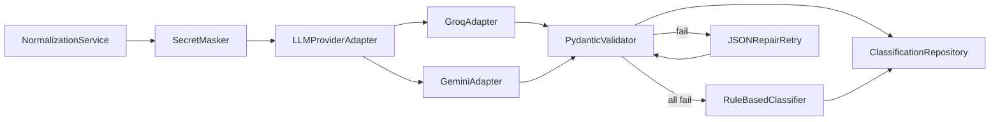

# AI Architecture

## Design principle

**Single-step classification** with pluggable providers — no agent orchestration in MVP.

## Component diagram



## Provider adapter interface

```python
class LLMProviderAdapter(Protocol):
    async def classify(
        self, context: FailureContext, prompt_version: str
    ) -> RawLLMResponse: ...
```

Implementations: `GroqAdapter`, `GeminiAdapter`, `OllamaAdapter` (local).

## Prompt management

- Prompts versioned as files: `packages/shared/ai/prompts/classification_v1.txt`
- `prompt_version` stored on each classification.
- Changes require eval re-run before promotion.

## Structured output strategy (free tier)

1. Include JSON schema example in prompt.
2. Request JSON-only response.
3. Parse with `json.loads`.
4. Validate with Pydantic `ClassificationOutput`.
5. Repair retry: append "fix JSON to match schema".
6. Failover to next provider.

## Rule-based fallback

Heuristic patterns:
- `TimeoutError`, `timed out` → timeout
- `401`, `403`, `Unauthorized` → authentication_issue
- `Connection refused`, `ECONNREFUSED` → infrastructure_issue
- `AssertionError` → product_defect (low confidence) or test_defect if selector keywords
- No match → unknown, insufficient_information=true

## Similar failure retrieval (non-AI)

Deterministic baseline — see event processing doc. No embeddings in MVP.

## Release-risk engine (non-AI)

Separate module in `packages/domain/risk_engine.py`. Documented in ADR-008.

## Evaluation

- Dataset: `tests/evals/data/v1/`
- Runner: pytest plugin or script generating HTML/JSON report.
- CI: mocked responses; optional manual workflow with real keys.

## LangGraph / Agents SDK

**Not used in MVP.** See ADR-004. Revisit if multi-step investigation (fetch PR, compare diffs) added.

## Future: pgvector

Compare baseline vs semantic retrieval. ADR-005.

## AI observability

Log every call: provider, model, latency, tokens, success/fail, fallback reason.
