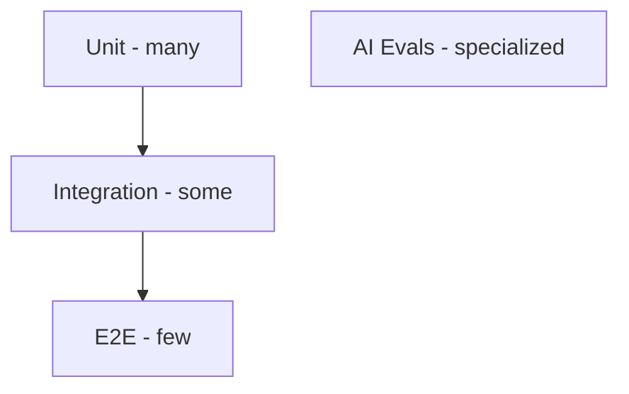

# Testing Strategy

## Testing pyramid

## Unit tests (`tests/unit/`)

| Area | Examples |
|------|----------|
| Normalization | fingerprint stability, field extraction |
| Secret masking | token patterns redacted |
| Risk engine | factor weights, golden scores |
| Rule classifier | pattern → category mapping |
| Pydantic schemas | invalid AI output rejected |
| Permissions | role checks |

**Target:** High coverage on domain and risk engine.

## Integration tests (`tests/integration/`)

| Area | Examples |
|------|----------|
| Repositories | CRUD, org isolation queries |
| API + DB | webhook ingest, idempotency |
| Worker | task processes fixture run |
| Migrations | alembic upgrade head |

Use test PostgreSQL (Docker or embedded) and Redis.

## Contract tests (`tests/contract/`)

| Contract | Validation |
|----------|------------|
| GitHub webhook fixtures | Schema + handler response |
| AI response JSON | Pydantic schema compliance |
| OpenAPI | Frontend types match (optional) |

Fixtures in `tests/contract/fixtures/github/`.

## E2E tests (`tests/e2e/`)

Critical path:
1. Ingest failed CI fixture
2. Worker processes (sync or test worker)
3. Classification created
4. Release assessment created
5. Submit feedback

May use Playwright for UI smoke optional in M5.

## AI evaluations (`tests/evals/`)

10 synthetic cases covering:
- Product regression assertion
- UI selector change
- Auth expiry
- DB connection failure
- Timeout
- Third-party API failure
- Infrastructure outage
- Known flaky test
- Insufficient context
- Prompt injection in logs

Each case defines: input, expected category, acceptable alternatives, disallowed claims, insufficient-info expectation.

**CI:** Mock LLM adapter with expected outputs.  
**Optional:** Manual workflow `eval-live` with real Groq key.

## Worker tests

- Task idempotency
- Retry behavior on simulated LLM failure
- Permanent failure state

## Frontend tests

- Component tests for key screens (optional minimal)
- API integration via MSW mocks

## GitHub Actions CI pipeline

1. Lint (ruff), format check
2. Type check (mypy)
3. Unit tests
4. Integration tests (service containers)
5. Contract tests
6. Migration check
7. E2E (subset)
8. AI evals (mocked)
9. Docker build

No live API keys in PR workflows.

## Definition of test done (per feature)

- Unit tests for domain rules
- Integration test if DB/API involved
- Contract test if external payload
- Eval case if AI behavior change
