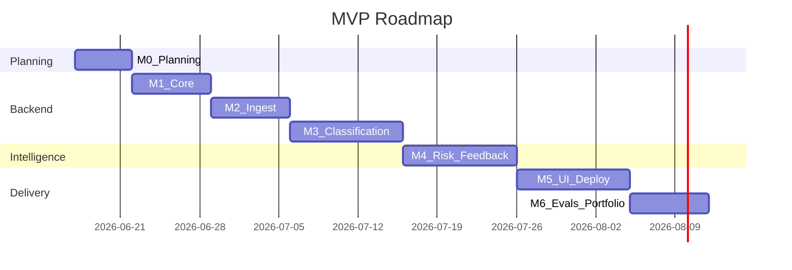

# Roadmap

## Horizon overview

| Horizon | Timeline | Theme |
|---------|----------|-------|
| MVP | Weeks 1–8 | CI triage + release risk on $0 stack |
| v1 | Weeks 9–12 | Real GitHub webhook, OAuth, quality hardening |
| v2 | Future | Multi-org, semantic retrieval, notifications |

## MVP roadmap (M0–M6)

## MVP deliverables

1. Full Phase A documentation (complete)
2. Runnable monorepo with API, worker, web
3. Seed demo with 5+ failure scenarios
4. Free-tier deployment with documented limitations
5. AI eval suite and case study materials

## v1 goals

- Controlled GitHub webhook on demo repo
- GitHub OAuth login
- Optional OpenAI adapter for quality comparison
- Improved flaky detection signal

## v2 possibilities

- Multi-organization support
- pgvector semantic retrieval
- Slack notifications
- Deployment correlation
- AWS deployment option

## Decision log

All major decisions in `docs/architecture/decisions/`.

## Roadmap review

Update at each milestone exit and in post-launch review template.
