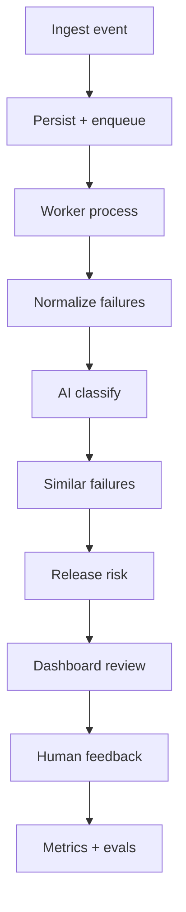

# User Journeys

## Journey map overview

Primary persona: **QA Automation Engineer**  
Primary use case: **Pre-release CI failure triage**

---

## Flow 1: CI workflow finishes and sends an event

**Actor:** GitHub Actions (future) / Seed script (MVP)  
**Trigger:** Workflow completes with `conclusion=failure`

1. GitHub sends `workflow_run` webhook (or operator replays seed fixture).
2. Payload includes workflow name, branch, commit SHA, conclusion, and artifact references.

**Outcome:** Event available for ingestion.

---

## Flow 2: System safely ingests the event

**Actor:** Platform API

1. API receives POST to `/api/v1/webhooks/github`.
2. Signature verified (HMAC); invalid requests rejected with 401.
3. Payload validated against schema; unknown fields preserved but non-blocking.
4. Idempotency key derived from delivery ID / run ID.
5. Duplicate delivery returns 200 with existing record reference.
6. Raw event persisted; audit entry created.
7. API returns 202 Accepted with correlation ID.

**Outcome:** Event stored; processing enqueued.

---

## Flow 3: Failed run processed asynchronously

**Actor:** Celery worker

1. Worker picks up `process_ci_run` task.
2. Task status set to `processing`.
3. Run linked to organization repository.
4. Failures extracted from payload / attached test report.
5. On success, status `completed`; on unrecoverable error, `failed_permanent`.

**Outcome:** CI run record with processing status.

---

## Flow 4: Failures normalized and stored

**Actor:** Normalization service

1. Each failure parsed: test name, suite, error type, message, stack trace, logs.
2. Secrets masked via pattern rules.
3. Normalized fingerprint computed (deterministic hash).
4. `FailureOccurrence` records persisted linked to CI run.

**Outcome:** Queryable, normalized failure records.

---

## Flow 5: AI-assisted classification created

**Actor:** Classification service + LLM adapter

1. Worker invokes classification for each failure.
2. Provider chain: Groq → Gemini → rule-based fallback.
3. Response validated via Pydantic; repair retry on JSON failure.
4. Classification stored with provider, model, prompt version, tokens, duration, evidence refs.
5. Original AI output never overwritten.

**Outcome:** Structured classification with confidence and evidence.

---

## Flow 6: Similar historical failures retrieved

**Actor:** Similarity service (deterministic)

1. Search same repository, last 90 days.
2. Match on normalized error message, test name, error type.
3. Score and rank candidates; store method and scores.
4. Return top matches linked to classification.

**Outcome:** Historical context for triage.

---

## Flow 7: Release-risk result calculated

**Actor:** Release-risk engine (deterministic)

1. Aggregate failures for CI run.
2. Apply weighted factors (critical failures, new vs known, classification confidence, data completeness).
3. Produce risk level, score, contributing factors, missing info, advisory recommendation.
4. Persist `ReleaseAssessment` linked to CI run.

**Outcome:** Explainable advisory release-risk result.

---

## Flow 8: User reviews the result

**Actor:** QA Automation Engineer

1. User logs into dashboard.
2. Opens CI runs list; filters failed runs.
3. Opens failed run detail: failures, classifications, similar failures, release-risk panel.
4. Reviews evidence citations against raw normalized failure data.

**Outcome:** Informed triage decision.

---

## Flow 9: User accepts or corrects classification

**Actor:** QA Automation Engineer

1. User clicks Accept or opens correction form.
2. May correct category, suspected component, add note, mark resolved, link cluster.
3. Submits feedback via POST `/api/v1/failures/{id}/feedback`.

**Outcome:** Human judgment recorded.

---

## Flow 10: Feedback stored for evaluation

**Actor:** Platform

1. Feedback persisted with original AI output snapshot.
2. Audit event logged.
3. Metrics updated (acceptance rate, correction rate).
4. Data available for AI eval comparison.

**Outcome:** Continuous quality measurement enabled.

---

## Journey diagram

